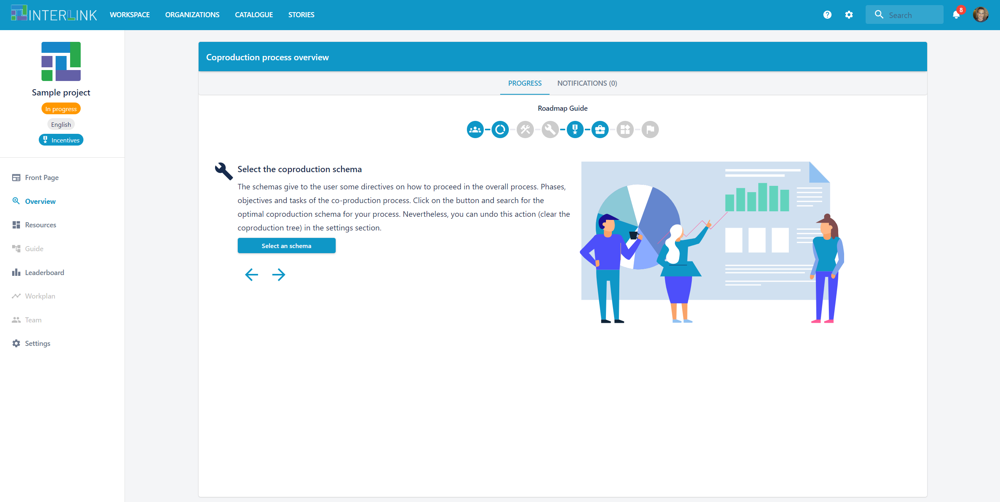
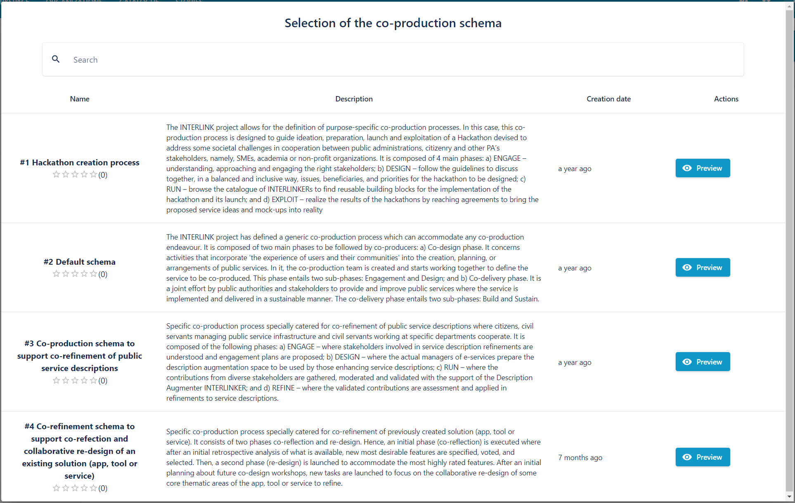
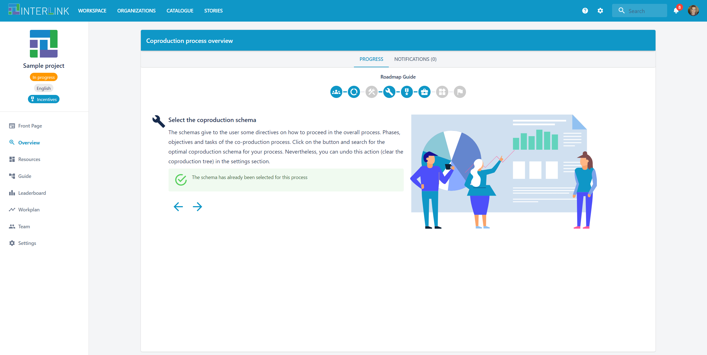
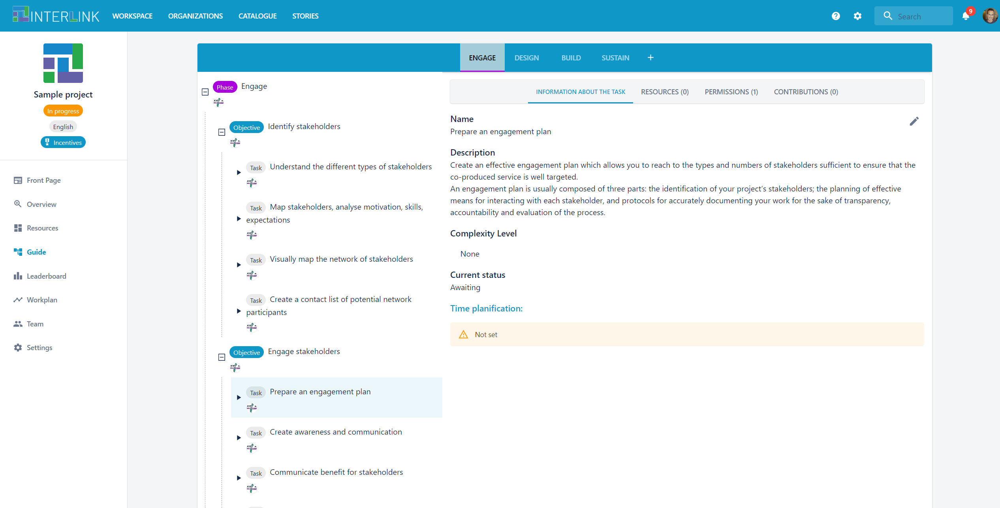
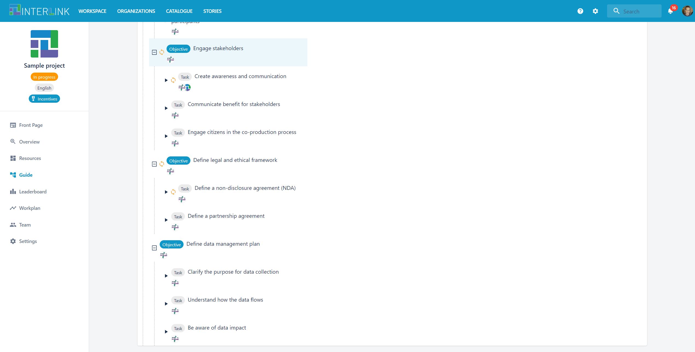
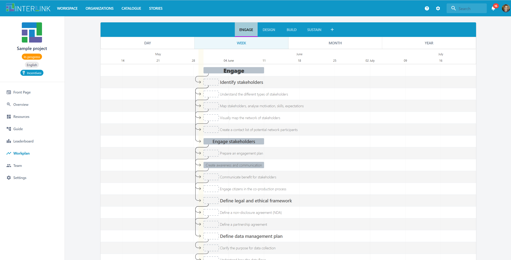
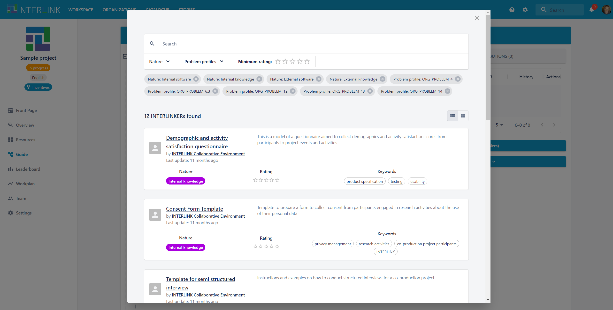
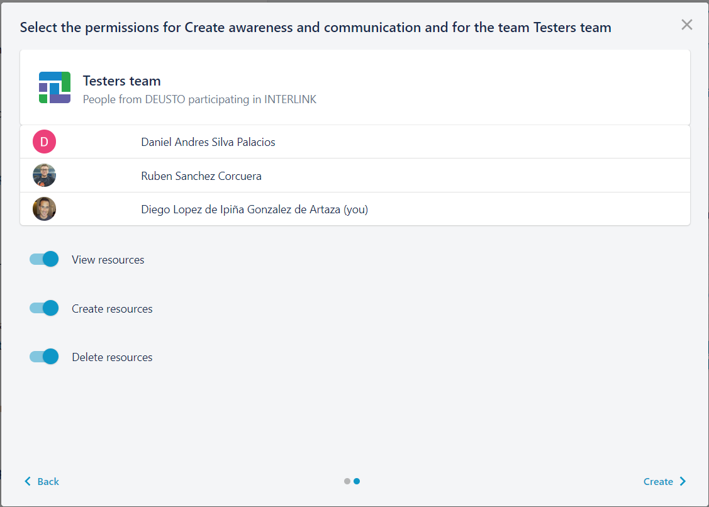

# Guide view of a coproduction process

The GUIDE view can be considered the main view of a co-production process. It is closely linked to other available views, namely [OVERVIEW](/docs/en/coproductionprocess-overview.html), [RESOURCES](/docs/en/coproductionprocess-resources.html) and [WORKPLAN](/docs/en/coproductionprocess-workplan.html) views of a co-production process. 

The [GUIDE view](/docs/en/coproductionprocess-guide.html) displays a co-production tree, allowing the co-production team members to browse through the phases of a co-production process, its corresponding objectives, the tasks that help accomplishing those objectives and the INTERLINKERs that are recommended to aid team members completing certain tasks of the co-production process. Very importantly, from the GUIDE view, users can instantiate the recommended INTERLINKERs for a task or create new instances from a range of generic INTERLINKERs.

After creating a new co-production process, the creator (which is the default administrator of the process) is requested to choose a co-production process guide. Notice that there is flexibility to choose the best fitting schema (you may check available co-production schemas in our [interlinkers-data/tree/master/schemas](https://github.com/interlink-project/interlinkers-data/tree/master/schemas) repo). The left-hand-side "Guide" menu item is not enabled until a schema has been chosen. The following three snapshosts show how the INTERLINK ["Default schema"](https://github.com/interlink-project/interlinkers-data/tree/master/schemas/default)) for a coproduction process is chosen and, hence, the Guide left hand side menu option is activated. It all starts when within the OVERVIEW view a user hits the "Select an schema" button. From the "Roadmap Guide" suite of buttons choose the "wrench" icon, fourth from the left hand side. 

   
   
   
   
As result, notice the activation of Guide view menu item on the left hand side: 

Some of the actions that you may carry out in the GUIDE view are: 
   - You may customize such tree to the specific needs of your co-production process. Notice the PENCIL icon on the top right hand side of tab "INFORMATION ABOUT THE TASK". At the bottom of this screen a "Remove task" is available. Besides, you are able to add new objectives & tasks, by clicking on "+" symbol next to the right most phase of a process, in the example SUSTAIN. Check below how a task is removed after having clicked on the PENCIL icon which appears on the right hand side of the task visualization panel.
   
   
   
   - Remember that specific co-production trees can be defined and, hence, selected (e.g. [VARAM case](https://github.com/interlink-project/interlinkers-data/tree/master/schemas/servicedescriptionenhancement)) as was done before with the "Default schema" of INTERLINK
   - You may also assign durations to tasks
   
   - Then, we can see in [WORKPLAN view](/docs/en/coproductionprocess-workplan.html) the time span defined, by clicking on the "Time planification" link in the [GUIDE view](/docs/en/coproductionprocess-guide.html) or clicking on the left hand side menu option named "Workplan". You may return to the Guide view, to see the task details by clicking on the name of the task in the WORKPLAN view, e.g. in the picture task "Create awareness and communication". 
   
   
   
The GUIDE view allows to instantiate INTERLINKERs to, hence, make progress in the co-production process. See tab RESOURCES within task view. For each of the tasks in the co-production phases you may select any of the recommended INTERLINKERs or instantiate a new one based on the generic software INTERLINKERs provided when clicking on blue button "Instantiate task resource (result) through generic INTERLINKERs (enablers)" at the bottom of the view of a co-production task. 

For intance, let's create a new document to define a collaboration agreement in a collaboration process.
- Select a task in the GUIDE view, e.g. ENGAGE > Engage Stakeholders > Create awareness and Communication
- Notice the INTERLINKERs recommended by clicking on button "Instantiate task resource (result) through recommended INTERLINKERs (enablers)"
        
	
- Select a task in the GUIDE view, e.g. ENGAGE > Define legal and ethical framework > Define a non-disclosure agreement (NDA)
- Click on the blue button at the bottom entitled "Instantiate task resource (result) through generic INTERLINKERs (enablers)" to give place to a new Google Docs document
	
- Select the type of document to create with the support of Google Drive INTERLINKER
	
- Realize about the new resource that appears at the top of the task description panel within its RESOURCE tab:
	
- Open it in Google Drive by clicking on the newly created resource name
	
- You may repeat the process, selecting a recommended INTERLINKER instead:
	- For instance, select *"Stakeholders Mapping Canvas"* INTERLINKER under task shown when navigating to *Engage > Identify Stakeholders*  
	- Click on button “Instantiate task resource (result) through recommended INTERLINKERs (enablers)”
	- Check the newly created resource appears at the top of the task description panel within RESOURCE tab
	- Open the generated resource in the form of a presentation and add some modifications

You may also assign PERMISSIONS to phases, objectives or tasks in the co-production tree. Let's select task ENGAGE > Define legal and ethical framework > Define a non-disclosure agreement (NDA) and click on the TASK VIEW's PERMISSIONS tab. First, click on button "Add new permission to the task"
	
Then, choose, among the available organizations, the one from which you want to appoint a TEAM to the task. Notice that you may use the button "+ Create new team" to create a brand new team if none of the already defined ones is suitable to take part and be granted permissions in the current coproduction process and selected task. 
	
Next, grant the corresponding resource access (view, create, delete) permissions to members of the team for that task. 
	
You should now see the granted permissions to the selected team for the task in question. 
	

If you visit the co-production process [TEAM view](/docs/en/coproductionprocess-team.html), by clicking on "Team" left hand side menu option, you should now see the permissions assigned to the before mentioned task.
	

Finally, you can see the progress achieved, so far, in a given co-production process by visiting the [OVERVIEW view](/docs/en/coproductionprocess-overview.html), by clicking on "Overview" menu item on the left hand-side menu option. In the case that you are administrator of the co-created process you will see two tabs, namely, PROGRES and RESOURCES. Users that are simply taking part in a coproduction process by being part of a team granted persmisions over coproduction tree items will only see the RESOURCES tab. 
	

