# Organization and team management in co-production processes

Before using the Collaborative environment, you must first login with your google credentials or create your own credentials at [https://demo.interlink-project.eu/](https://demo.interlink-project.eu/), i.e. the staging server of INTERLINK. Alternatively, you may do this process in your pilot server:
- [MEF pilot's deployment of Collaborative Environment](https://mef.interlink-project.eu/)
- [VARAM pilot's deployment of Collaborative Environment](https://varam.interlink-project.eu/)
- [Zaragoza pilot's deployment of Collaborative Environment](https://zgz.interlink-project.eu/)

**IMPORTANT**: All members of an envisaged team must have logged into the platform before they can be added to a team. Besides, as we will see, every team defined in INTERLINK must be first bound to an ORGANIZATION.  

To illustrate organization and team management, let's consider two possible users that want to take part in different co-production processes. In the figure you can see two members who after having logged in are shown the coproduction processes on which they are currently involved. In this case, the processes named "Zaragoza Apps4Good" and "New coproduction process" are shown to both. Notice that a user is bound to a co-production process (and, therefore, sees a coproduction process) in two possible manners:
- The user has been appointed as admin of the process through the [SETTINGS view](/docs/en/coproductionprocess-setting.html) of the coproduction process. 
- The user has been added to a team who has been granted permissions over some nodes in a given co-production process.
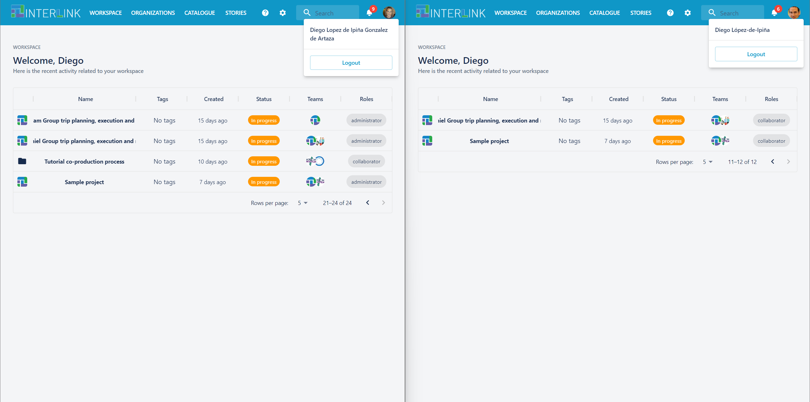 

Every user can create a new organization. See in the following screenshot how user "Diego López-de-Ipiña" can create a new organization by clicking on "+Create new organization" blue button. However, a user who is not the administrator of an ORGANIZATION, e.g. "FBK" case, cannot, by default, create a new team by clicking the blue button "+ Create a new team", which in this case is deactivated. 

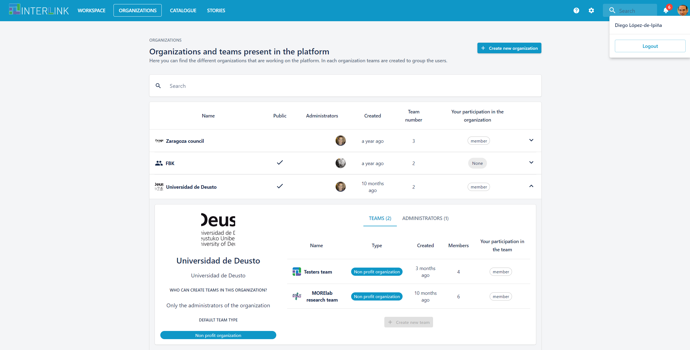

Notice that option "Who can create teams" in an organization can have any of the following values: "Only the administrators of the organization" (default), "Members of at least a team in the organization" or "Anyone (the organization must be public)". Besides, be aware that apart from the title and description, an organization can be declared as PUBLIC, i.e. every logged in user can see it and have a default type for the teams that are created within a given organization. The possible options being "Citizens", "Public administration", "Non profit organization" or "For profit organization". 
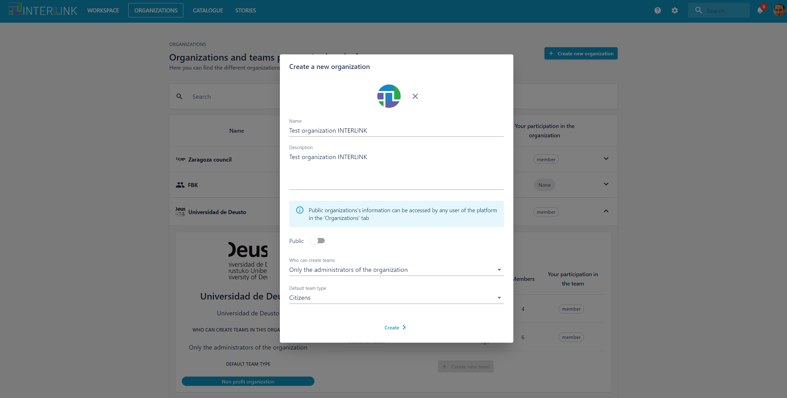

After hitting the "Create" button a new ORGANIZATION with no teams associated to it appears. 
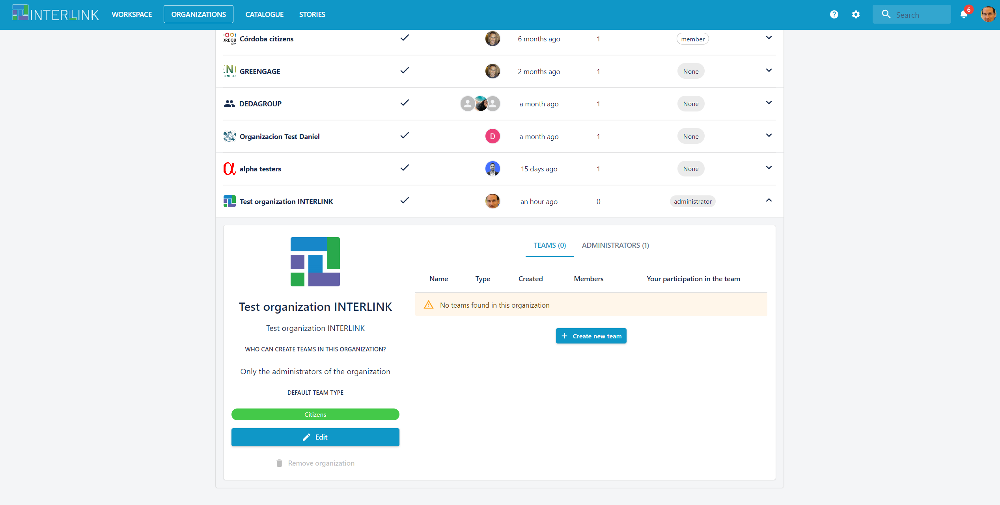

If another user "Diego Lopez de Ipina Gonzalez de Artaza" as shown in the figure below checks the organizations that it can see or manage, it will find the newly created public organization, named "Test organization INTERLINK", since it is public, but s/he will not be able to add new teams to it. 

Going back to the other user "Diego López-de-Ipiña" who is the administrator of the organization "Test organization INTERLINK", he can click on blue button "+ Create new team" and fill in a pop up dialogue with the following fields: name of the team, its description, the role that its users will play (by default the same of the parent organization) which in this case is changed to "Non profit organization". When clicking button "Next" the organization admin can include other previously logged in users or previously appointed users to other teams in the organization to the current team. Notice, that the system recommends users who have already taken part in the organization. After adding the required users, the organization admin is now presented the newly created team. 

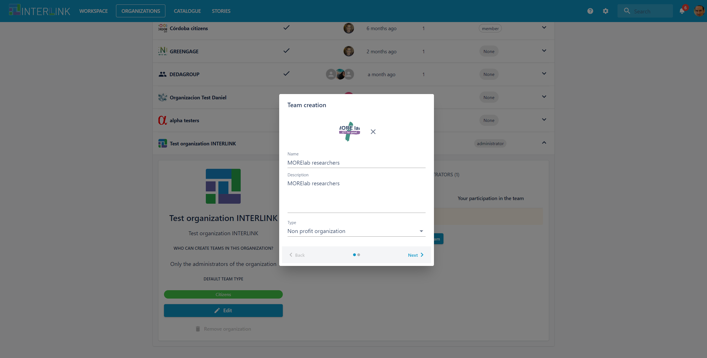
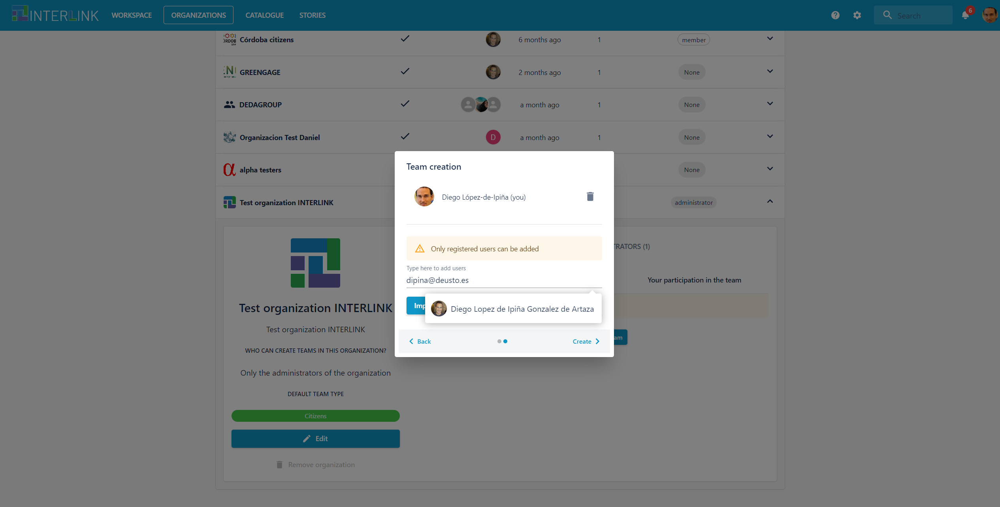
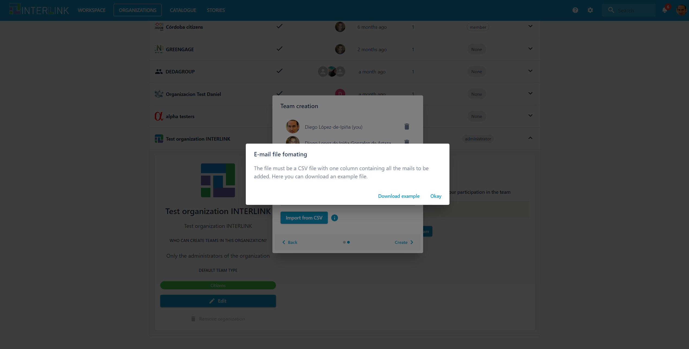

The creator of a team may edit the details of team by clicking on top of the name of the team. The following dialogue shows up:
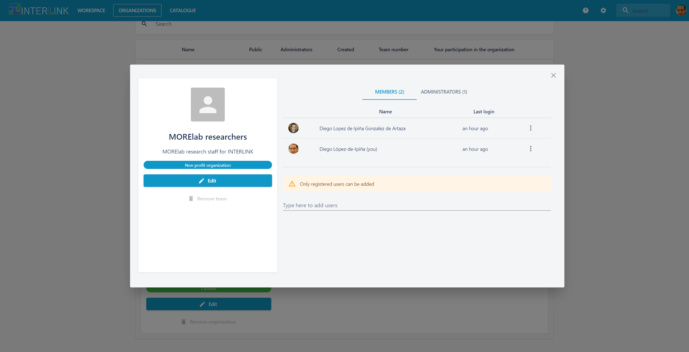

When the user clicks on the blue button "Edit" the user may change the name and description of the team, appoint new members to the team, or assign other administrators to the team. 

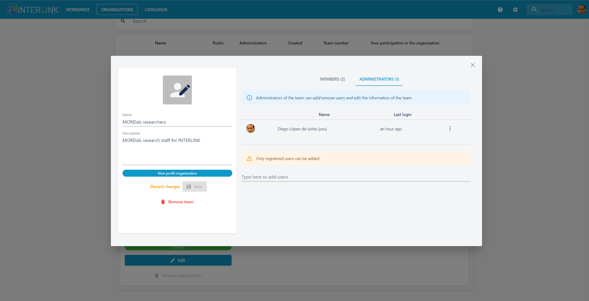

A user that belongs to a team in an organization but is not its administrator can see the details of the team but cannot perform changes to it. See below, what user "Diego Lopez de Ipina Gonzalez de Artaza" sees regarding team "MORElab researchers"
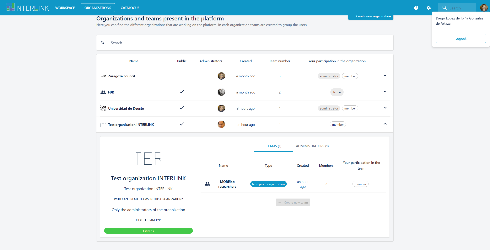
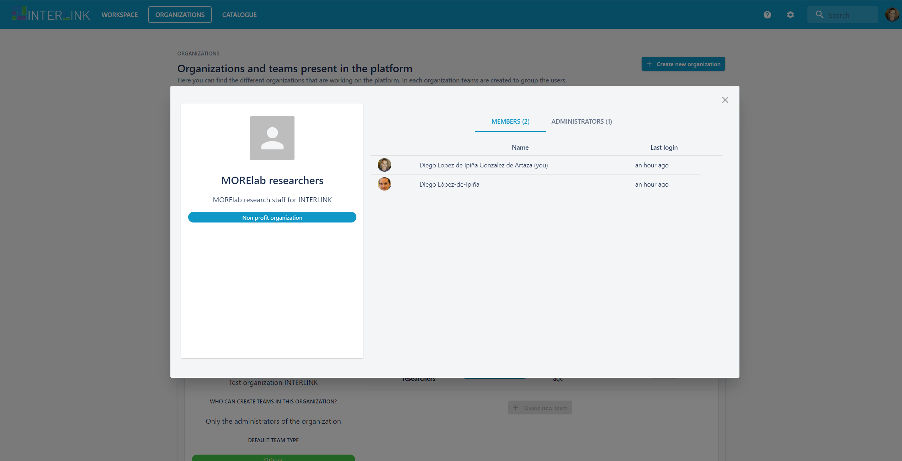

Once a team has been created, coproduction process administrators can associate teams to different coproduction tree nodes, i.e. to phases, objectives or tasks. See the coproduction process GUIDE view for more details. Remember that the main purpose of a team in the Collaborative Environment is to take part in a [co-production process](/docs/en/coproductionprocess-overview.html). Consequently, we need to create a co-production process where the activity to co-create will be managed.

In order to **link the created team to the created co-production process**, you must select a phase, objective or task in a co-production process and within its PERMISSION tab, click on blue button "Add new permission to ...". The following snapshots illustrate the proces.
- Add new permisson to task
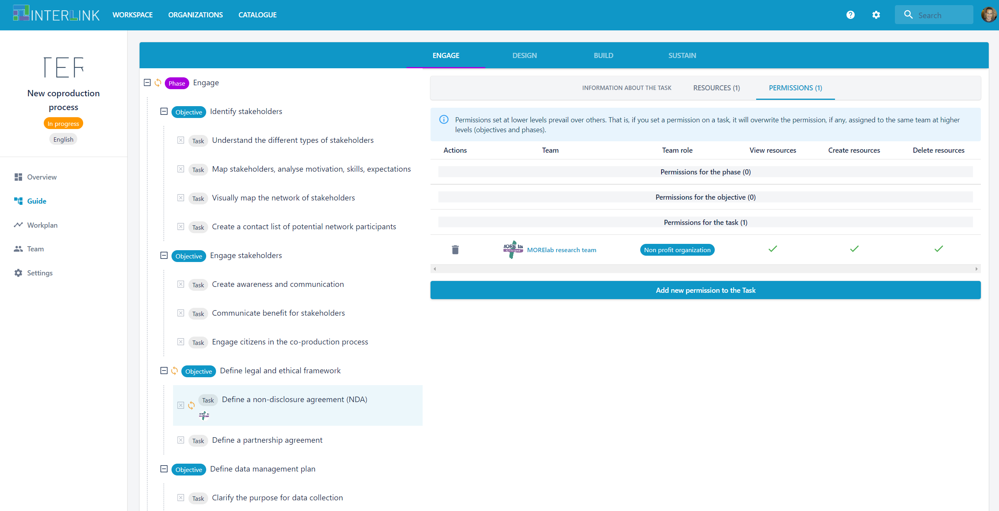
- Select team in organization
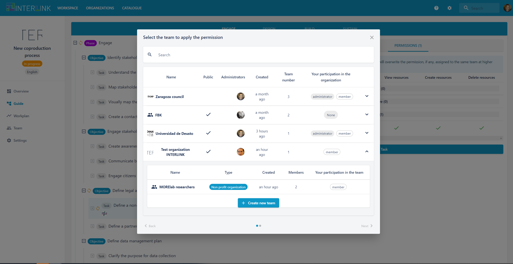
- Assign resource permissions to team

- View the new team bound to task through permissions

Notice that you may create new teams with different roles and associated permissions to a given co-production process. The permissions of a team apply to the chosen phases, objectives or tasks. 

You may also assign a team to a co-production process through the Teams view of a given co-production process by clicking on button "Add new permission to the overall process", as shown in the figure below.
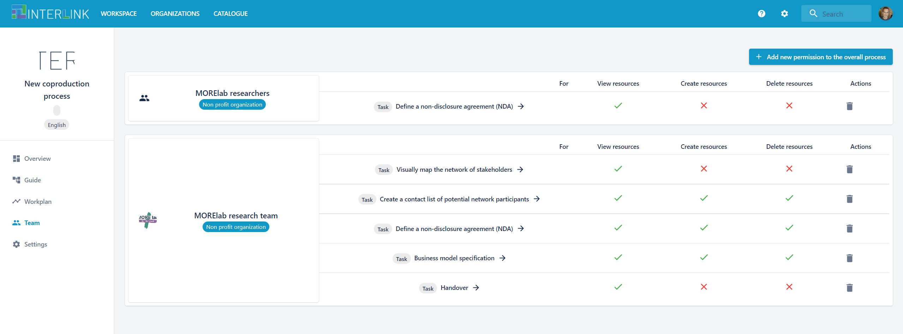

Now, you should select a given team through the window that pops us with all available organization and teams, as shown below.
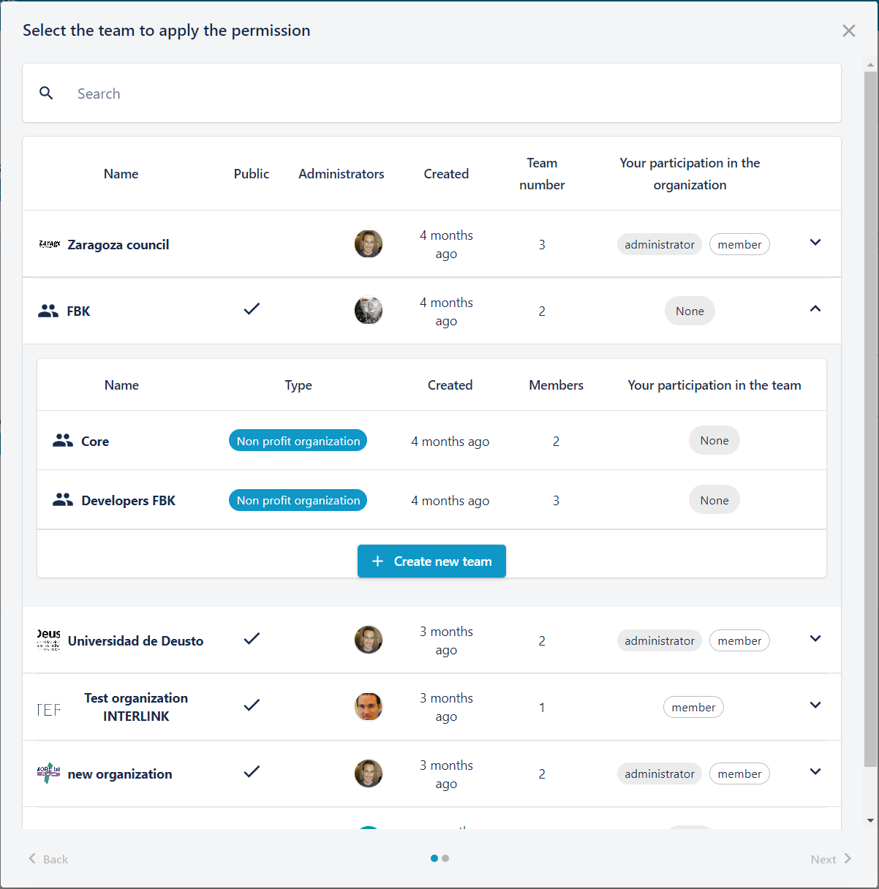

The selected team should have access rights granted to the resources generated across the whole co-production tree. In this case we have only granted resource view access to this team, they can neither write nor delete resources. 
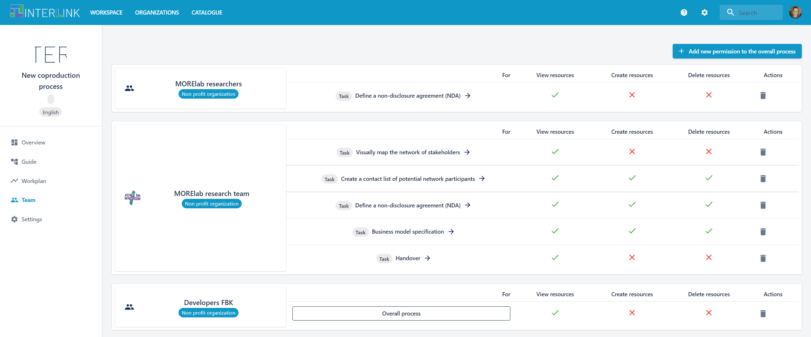

## Exporting team members mails to a CSV file

You may export the list of members of a given team to a CSV file by clicking on the button "Download e-mails" as shown in the figure below.

## Creating a new team or adding users to already created one from a CSV file

You may create a new team or add users to an already created one by importing a CSV file with the list of users to be added. The CSV file must have the following format:

- All the mails should be in the first column.
- One mail per row.

Here you can download a [sample CSV file](/files/sample-csv-file.csv) with the list of users to be added to a team.

Once you have the CSV file, you can import it by clicking on the button "Import from CSV" as shown in the figure below to create the team with the imported members.
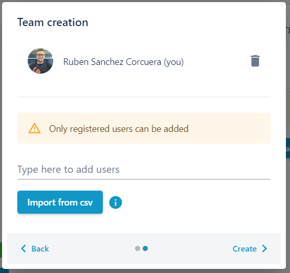

Furthermore, you can import it by clicking on the button "Import from CSV" as shown in the figure below to add the imported members to an already created team.
