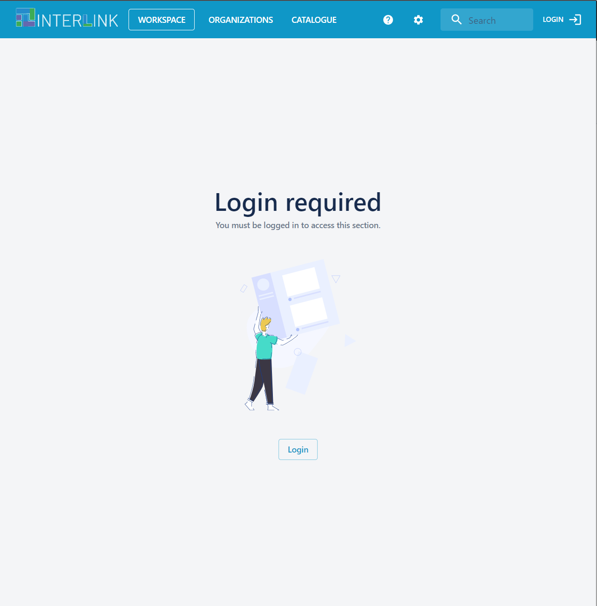
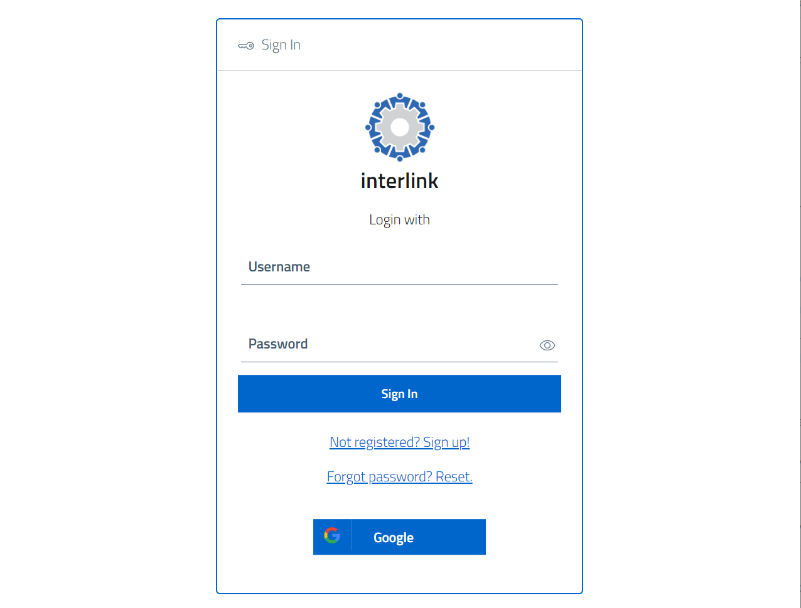
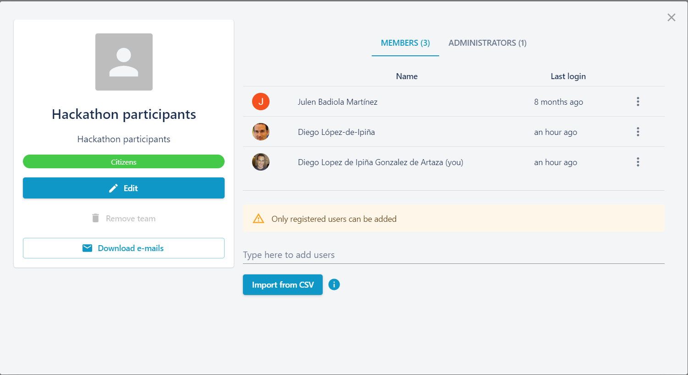

# Dashboard

When a user accesses one to the INTERLINK collaborative front-end encounters a page informing about:
- [INTERLINK project](https://demo.interlink-project.eu/) (top menu option "Project")
- The [Collaborative Environment](https://demo.interlink-project.eu/platform) ("Collaborative Environment" top menu option) giving details about the Collaborative Environment made available by the project
- The INTERLINK [co-production methodology](https://demo.interlink-project.eu/coprod) ("Co-production" top menu option)
- The [INTERLINKERs catalogue](https://demo.interlink-project.eu/catal) ("Catalogue" menu option) where unregistered users can browse, filter and search over available INTERLINKERs
- The [About](https://demo.interlink-project.eu/about) page ("About" menu option") where users can learn about the INTERLINK project. 
- The Settings pop up menu which allows users to select the theme, namely "Light" or "Dark" view and the language of the user interface, being able to select among English, Spanish, Latvian or Italian. 

When a user clicks on button ["Access Collaborative Environment"](https://demo.interlink-project.eu/dashboard) it will be given access to the INTERLINK Collaborative Environment front-end.

**IMPORTANT**. You may use INTERLINK's deployment at [Staging Server](https://demo.interlink-project.eu/), or, alternatively, you may access the Collaborative Environment's Dashboard in your pilot server:
- [MEF pilot's deployment of Collaborative Environment](https://mef.interlink-project.eu/)
- [VARAM pilot's deployment of Collaborative Environment](https://varam.interlink-project.eu/)
- [Zaragoza pilot's deployment of Collaborative Environment](https://zgz.interlink-project.eu/)

Before using the Collaborative environment, for first time, you must first login with your google credentials or create your own credentials at [https://demo.interlink-project.eu/](https://demo.interlink-project.eu/), i.e. the staging server of INTERLINK. **IMPORTANT**: All members of an envisaged team must logged into the platform before they can be added to a team.  

Once logged in, you are given access to the INTERLINK Dashboard view, where the user has access to three core main functionalities:
- [Workspace](https://demo.interlink-project.eu/dashboard): the user can see the co-production processess where s/he is taking part in or create new co-production processes if needed by clicking on top right hand side button named "+ Create new process". 
- [Organizations](https://demo.interlink-project.eu/dashboard/organizations): the user can see the organizations that are registered in the collaborative environment and browse through the teams within the created organizations. Besides, the user can create new organizations by clicking on top left hand side button "+ Create new organization"
-  [Catalogue](https://demo.interlink-project.eu/dashboard/interlinkers): the user is given access to the INTERLINKERs catalogue where s/he can browse through the available INTERLINKERs, filter them according to their "Nature", "Problem profile", "Minimum rating" or their title contents.

Within "ORGANIZATIONS" section of dashboard, after the user clicks on "ORGANIZATIONS" top menu option, once a user hits "+ Create new organization", s/he is shown a pop-up window where a new organization details (Name, Description, publickly seen or private, who can create teams option and the default team type, namely, Citizens, Public administration, Non profit organization and For project organization) can be input.

Once a new organization has been created, the user is shown in the dashboard's organization view those public teams or private teams the loged in user is administrator of.  

The user may browse through the already created teams in an organization or create a new team by clicking on button "+ Create new team". An already existing team details can be modified by clicking on the blue "Edit" button. Notice that new members or administrators can be appointed to a team. New team members are suggested when typing part of their name or email address if they have already registered with the environment. Clicking on the button "+Create new team", the user is given the option of adding a logo to the team, its name, description and to select what type of team will be, i.e. representing "Public administration", "Citizens", "Non profit organization" or "For profit organization". After adding the metadata of the team, the user is given the option to add new members to such team.  

Within "WORKSPACE" section, after the user clicks on "WORKSPACE" top menu option,, once a user hits "+ Create new process", s/he is shown a pop-up window where a new process details (Name, Language, Description) can be input.

. 

The user is automatically switched to the ["co-production process" view](/docs/en/coproductionprocess-guide.html). The user can always check the coproduction processess s/he is taking part in by clicking on on "WORKSPACE" top menu option.
